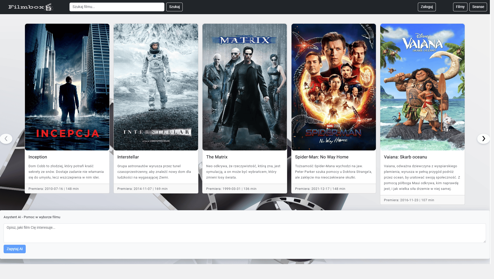

# Filmbox

Rozbudowana aplikacja kinowa, która umożliwia użytkownikowi przeglądanie repertuaru, rezerwację miejsc oraz zakup biletu online. Projekt uwzględnia integrację płatności (Stripe) oraz autoryzację (Okta).

Aplikacja kinowa stworzona z wykorzystaniem Angulara i Spring Boota, umożliwiająca kompleksowe zarządzanie repertuarem oraz rezerwację biletów online. Projekt zaprojektowano z myślą o użytkownikach, którzy chcą w prosty i wygodny sposób przeglądać seanse, wybierać miejsca na sali oraz dokonywać szybkich płatności przez Internet.

Warstwa frontendowa została oparta na frameworku Bootstrap, co zapewnia pełną responsywność i nowoczesny wygląd interfejsu. Dodatkowo wykorzystałem Swiper, który umożliwia płynne przeglądanie filmów w formie karuzeli.

Po stronie backendu za logikę biznesową odpowiada Spring Boot, a dane przechowywane są w relacyjnej bazie MySQL. Struktura bazy została zaprojektowana z wykorzystaniem powiązanych tabel (filmy, seanse, bilety, miejsca, użytkownicy, rezerwacje), co pozwala na skuteczne odwzorowanie działania rzeczywistego systemu kinowego. W projekcie zastosowano Spring Data JPA, co usprawniło operacje CRUD i komunikację z bazą.

## Wykorzystane technologie
**Angular, Java, Spring Boot, Maven, MySQL, Stripe, Okta**

 

