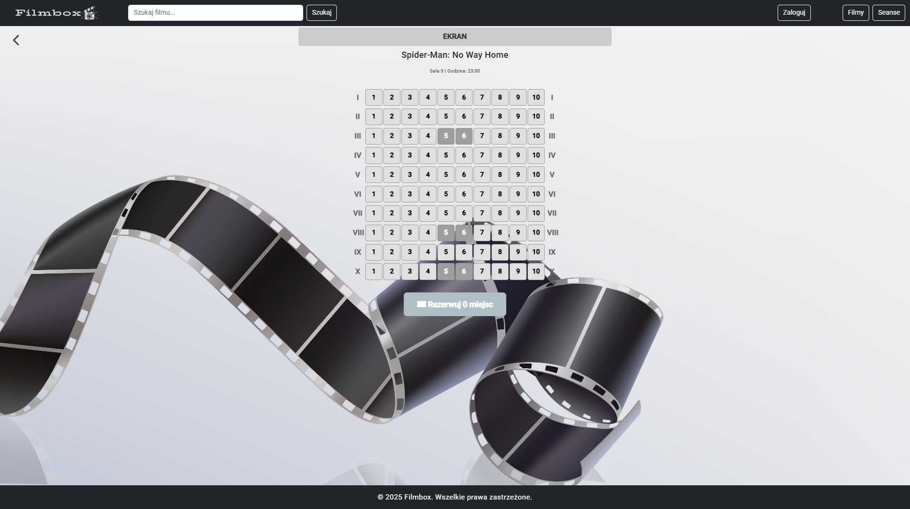
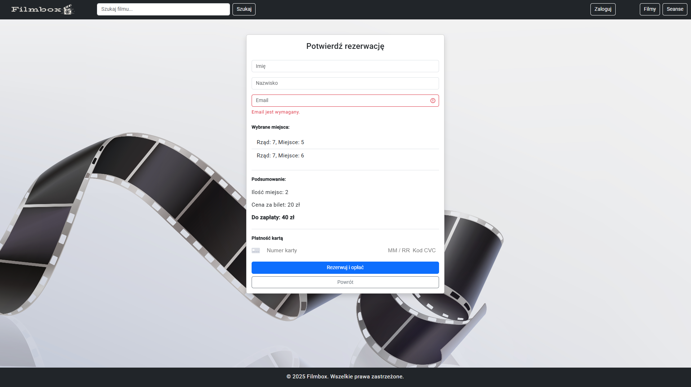
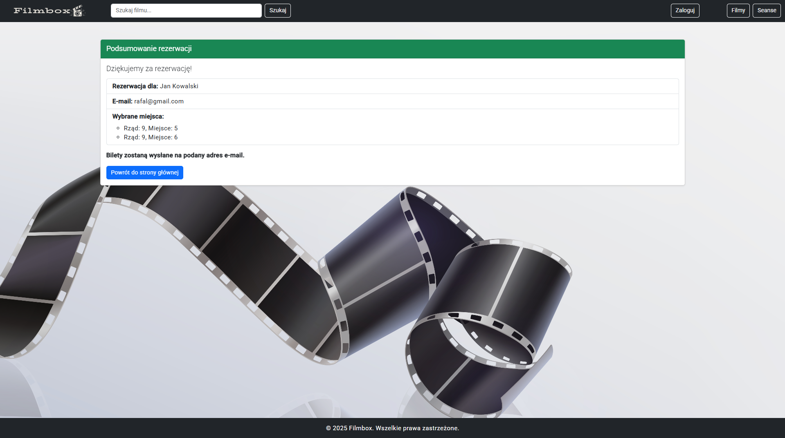

# Filmbox

A comprehensive cinema application that allows users to browse the repertoire, reserve seats, and purchase tickets online. The project includes full payment integration (Stripe) and user authorization with Okta.

CinemaApp was built using **Angular** on the frontend and **Spring Boot** on the backend, providing a complete system for managing movie screenings, seats, reservations, and user accounts. The goal of the application is to offer a smooth, intuitive experience for browsing movies, selecting seats on an interactive map of the auditorium, and completing secure online payments.

The frontend uses **Bootstrap** to ensure a fully responsive layout and a clean, modern interface. The **Swiper** library is used to create a dynamic movie carousel, allowing users to quickly explore available titles.

The backend, developed in **Spring Boot**, handles business logic and communicates with a **MySQL** database. The system uses a relational schema with connected tables such as:  
**movies, screenings, seats, tickets, users, reservations** — accurately reflecting real cinema operations. Integration with **Spring Data JPA** made CRUD operations and database communication more efficient and maintainable.

## Technologies Used
**Angular, Java, Spring Boot, Maven, MySQL, Stripe, Okta**

 

## Home Screen – Repertoire Overview

Users start on the main page, which features a clean and responsive layout showcasing the current movie repertoire. The intuitive movie carousel allows for effortless browsing between films. In addition, an AI assistant is prominently available on the homepage, guiding users through the selection process and offering personalized recommendations to help them find the perfect movie for their mood or preferences.

  

## Movie Details & Schedule

After selecting a movie, the user is taken to the detailed movie page. This page provides a full description of the film and all key information. If available, the trailer can be viewed directly on the page. The complete schedule of upcoming screenings is displayed, allowing users to choose a suitable showtime.

  

When a screening is selected, the user proceeds to the seat reservation view, where they can select their seats for the chosen show.

## Seat Reservation – Hall Layout

The cinema hall layout is displayed with row and seat numbering. Users can browse available seats, select their preferred ones, view a summary of the number of seats chosen, and proceed to the next step of the reservation with a single click. The page also shows the movie title, hall name, screening time, and a preview of the screen at the top of the layout.

  

## Registration Form

After selecting seats, the user fills out a simple registration form. The form collects the essential information required to finalize the reservation, such as the user's name and email address. Once the form is submitted, the booking is processed and the user is taken to the final confirmation page.

  

After a successful payment, the user is taken to the reservation summary screen.
The confirmation page displays:

- the name used for the reservation,

- the email address where the tickets will be sent,

- all selected seats listed clearly

This screen serves as the final step of the booking process, giving the user a clear overview of their completed reservation.

  

## Admin panel

The application includes a dedicated administration panel, giving authorized users full control over the cinema’s content and schedule. From this interface, administrators can efficiently manage the entire repertoire by:

- adding and editing movies,

- creating and modifying screenings,

- updating the cinema’s schedule,

- managing metadata such as genres, duration, posters, and other key details.

This panel streamlines day-to-day operations and ensures the repertoire remains accurate and up to date.

  